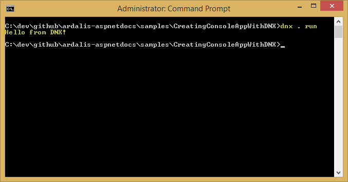
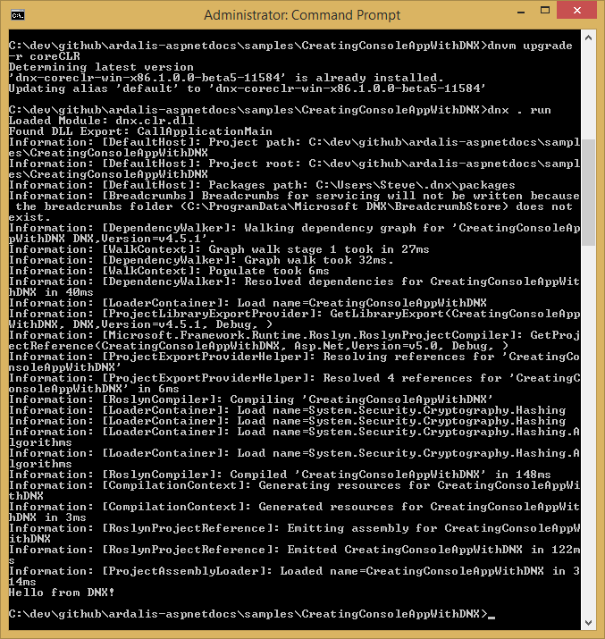

Creating a Cross-Platform Console App with DNX
==============================================

By Steve Smith

Using the .NET Execution environment (DNX), it's very easy to run a
simple console application.

In this article:

- Creating a Console App
- Specifying Project Settings
- Running the App

You can [view and download the
source](https://github.com/aspnet/Docs/tree/master/samples/CreatingConsoleAppWithDNX)
from the project created in this article.

Creating a Console App
----------------------

Before you begin, make sure you have successfully installed DNX on your system:

- [Installing on Windows](installing-core-windows.md)
- [Installing on Mac OS X](installing-core-osx.md)
- [Installing on Linux](installing-core-linux.md)

Open a console or terminal window in an empty working folder, where
`dnx` is configured.

Creating a console application is extremely straightforward. For this
article, we're going to use the following C\# class, which has just one
line of executable code:

It really doesn't get any simpler than this. Create a file with these
contents and save it as `Program.cs` in your current folder.

Specifying Project Settings
---------------------------

Next, we need to provide the project settings DNX will use. Create a new
`project.json` file in the same folder, and edit it to match the listing
shown here:

Save your changes.

Running the App
---------------

At this point, we're ready to run the app. You can do this by simply
entering `dnx . run` from the command prompt. You should see a result
like this one:

> **note**
>
> `dnx` references several [environment
> variables](https://github.com/aspnet/Home/wiki/Environment-Variables),
> such as `DNX_TRACE`, that affect its behavior.

Set the `DNX_TRACE` environment variable to 1, and run the application
again. You should see a great deal more output:

In this example, running on the Windows platform, the default behavior
for DNX is to run on the full .NET Framework. You can switch to use the
CoreCLR by running `dnvm upgrade -r CoreCLR`. To return to using .NET
CLR, run `dnvm upgrade -r CLR`.

You can see the app continues to run after switching to use CoreCLR:

Summary
-------

Creating and running your first console application on DNX is very
simple, and only requires two files.
